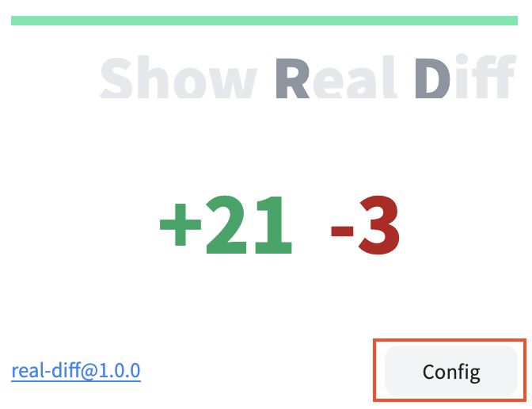
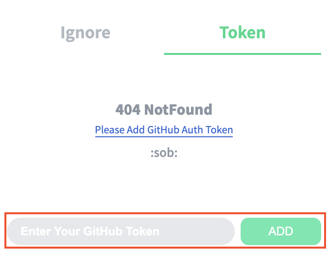

  

**Chrome Extension for Calculate Pull Request's Real Diff.**

By default, changes to the `package-lock.json` and `yarn.lock` files are excluded. In the Ignore tab of the Config page, additional files to be ignored can be added.

## Install

Chrome Extension > [Link](https://chrome.google.com/webstore/detail/octodirect/noolkogacjfdckeeclgddpabknbnjacd?hl=ko)

## For Private GitHub Repository

1. Create your personal token at GitHub Settings with this [guide](https://docs.github.com/en/github/authenticating-to-github/creating-a-personal-access-token).

2. Save your token at Token Setting page

|            **Click Config**            |           **Save Your Personal Token**            |
| :------------------------------: | :----------------------------: |
|  |  |

3. Go back to main page

## Reference Repository

- [chrome-extension-typescript-starter](https://github.com/chibat/chrome-extension-typescript-starter)
- [octodirect](https://github.com/JaeYeopHan/octodirect)
